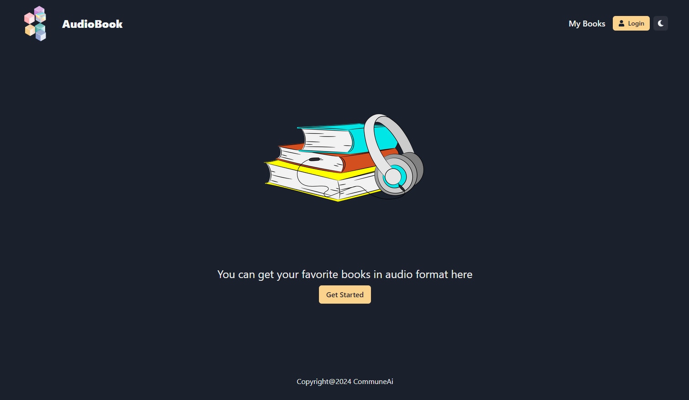
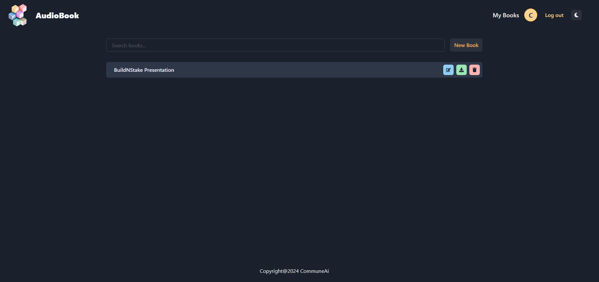

# audio-book
AudioBook from Book texts

## Frontend

> To install dependencies
npm i

> To build for production

npm run build

> To run frontend

npm run serve

## Run backend

flask --app app run --host 0.0.0.0

